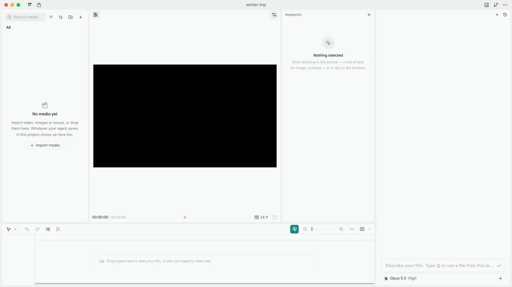

<p align="center">
  <br>
  
  
</p>

<h3 align="center">开源的 AI 视频智能体。</h3>

<p align="center">一个 HTML 文件，一个函数，一个真正的剪辑器。</p>

<p align="center"><a href="README.md">English</a> · <b>简体中文</b></p>

## 简介

OpenFilm 让你的编程智能体来做视频，也让你亲手修改。

让 Codex、Claude Code 或任何编程智能体做一部片子。它把片子写成网页，Studio（一个在浏览器里运行的本地剪辑器）
实时显示片子成形的过程。之后哪里想改就改，可以自己动手，也可以直接跟它说。

- **一个 HTML 文件。** `film.html` 把动画网页、视频素材、图片和声音按轨道剪在一起，样式用 CSS 写。不用学新东西：
  你的智能体本来就懂网页。
- **一个函数。** 每个镜头都是一个网页，用 `frame(t)` 画出任意时刻，浏览器能画的都能用：three.js、WebGL、canvas、
  SVG、CSS、GSAP、视频等等。不需要框架（比如 Remotion 或 HyperFrames）：一个函数就够了。
- **一个真正的剪辑器。** 可以移动、缩放、旋转页面里的任何元素，改它的文字、颜色和样式；摆放、裁剪、调整每个片段的
  样式，在时间线上修剪和切分。

<p align="center"></p>

## 安装

需要 Node 22.2+ 和 ffmpeg，支持 macOS、Windows、Linux（Studio 保存版本还需要 git）；第一次运行会下载一个无界面的
Chromium（约 100 MB）。

```sh
npx skills add openfilm/openfilm
```

然后让你的智能体做一部片子：

> 给我的命令行工具做一支 20 秒的发布视频，带配乐。

它会在 Studio 里打开这部片子，你能看着它一步步成形。如果你的智能体不支持 skill，就对它说：“运行
`npx -y openfilm@latest`，按它打印的手册来做。”

也可以从 [openfilm.dev](https://openfilm.dev) 或 [Releases](https://github.com/openfilm/openfilm/releases)
下载 macOS 或 Windows 桌面版：就是 Studio，旁边多了一个对话窗口，接上你已有的智能体。

制作、剪辑和渲染片子都不需要账号。需要生成配音、音乐、图片和视频时，在 Studio 的设置 → 服务商里，用你自己的 key
连接你在用的服务（ElevenLabs、OpenAI、Google、fal 等）。

想从一部完整的片子开始，可以打开一个[示例](https://github.com/openfilm/examples)：

```sh
npx -y openfilm@latest open https://github.com/openfilm/examples/tree/main/one-prompt
```

## 命令

这些命令由你的智能体来运行；你也可以自己运行：`npx -y openfilm@latest <命令>`，或者先 `npm i -g openfilm`。

```sh
openfilm                          # 手册：智能体需要知道的全部内容
openfilm open   [folder | url]    # 在 Studio 里打开片子：新建、打开已有的、从 GitHub 获取，或者当前目录的、上次打开的
openfilm look   [what] [t | a-b]  # 检查片子、某个页面或媒体文件：缩略图总览、单帧或一段区间
openfilm render [a-b]             # 渲染成 MP4；--4k、--blur（运动模糊）、--alpha（.webm / .mov）
openfilm get    [what]            # 用你接入的服务生成配音、音乐、音效、字幕转写、图片和视频
```

`openfilm <命令> --help` 列出某个命令的选项；单独运行 `openfilm get` 会列出能生成什么，以及怎么在 Studio 里用你
自己的 key 接入服务。

## Studio

Studio 在你的电脑上运行，在浏览器里打开。片子里的一切都能改：画面里的文字和图层，时间线上的片段，它们的位置、外观、
音量和速度，还有字幕。你的修改会保存到片子的文件里，智能体能看到并保留它们；你也可以保存带名字的版本，随时回退。
可以导出视频、GIF、声音或分轨、字幕、静帧、幻灯片、透明背景视频，也可以把整条时间线导出给 Premiere Pro 和
DaVinci Resolve。

桌面版（[apps/desktop](apps/desktop)）就是 Studio 加上一个对话窗口，可以用 Claude Code、Codex 等智能体，也可以用
它自带的智能体配上你自己的 key。

## 工作原理

一部片子就是一个带 `film.html` 的文件夹：由片段组成的轨道剪在一起。

```html
<meta name="viewport" content="width=1920, height=1080">
<style>
  .card { object-fit: cover; border-radius: 24px; }
</style>
<section>
  <iframe src="title.html#t=0,4"></iframe>
</section>
<section>
  <video src="assets/footage.mp4#t=12,18" at="4" speed="0.5" class="card" style="left: 160px; top: 90px; width: 1600px; height: 700px"></video>
</section>
<section>
  <audio src="assets/music.mp3" volume="0.6"></audio>
</section>
```

每个 `<section>` 是一条轨道，顺序和时间线上一致：第一条在最上层。一个片段就是一个元素：页面、视频、静态图片或声音。
播放文件的哪一段用媒体片段标记（`#t=12,18`），从什么时候开始用 `at`，放在哪里用样式里的 `left`、`top`、`width` 和
`height`，长什么样用 CSS。每个声音都是独立的片段。`overrides` 保存你对页面里元素的修改，智能体编辑时会保留它们。

一个页面就是一个能画出自己任意时刻的网页，这就是全部约定：

```html
<script type="module">
window.film = {
  frame(t) { /* 画出第 t 秒的完整画面，用什么画都行 */ },
  duration: 4,               // 可选：它自己的时长，单位秒
  ready: loadFonts(),        // 可选：等字体、图片、模型、数据加载完的 Promise
  width: 480, height: 320,   // 可选：只占画面一部分的页面
};
</script>
```

**唯一的规则：** 同一个 `t` 永远画出同一个画面，不管之前画过什么。渲染时会乱序、并行地请求各帧，还会请求两帧之间的
时刻（用于运动模糊），所以遵守这条规则的页面，在任何尺寸、任何电脑上渲染出来都一样。其他能出画面的东西（Python、
Blender、视频生成模型）以视频或图片的形式接进来。

OpenFilm 把功夫花在模型容易出错的地方：检查片子。`look` 会把总览里的每一帧按两种打乱的顺序各画一遍，指出前后不一致
的帧，同时报告页面错误、加载失败的字体、缺失的声音文件，以及被画面边缘截断的文字。

[MANUAL.md](packages/openfilm/MANUAL.md) 是 `openfilm` 给你的智能体看的手册；[SPEC.md](packages/openfilm/SPEC.md)
是给想做播放器、渲染器或剪辑器的人看的格式规范。

## 从源码运行

需要 Node 22.18 或更高版本、pnpm 9（`corepack enable` 会自动使用本仓库指定的版本）、PATH 里有 ffmpeg，以及 git。

```sh
git clone https://github.com/openfilm/openfilm && cd openfilm
pnpm install
pnpm dev            # 用这份源码运行 Studio，带一部示例片，和你安装的 OpenFilm 互不干扰
pnpm test
```

`pnpm dev` 还会打印一条命令，你的编程智能体运行它，就能用这份源码在这个 Studio 里做片子。

`pnpm dev:desktop` 从源码运行桌面版；`pnpm typecheck`、`pnpm build` 和 `pnpm audit:public` 分别是类型检查、构建和
公开内容审计。各个包的详细说明见 [CONTRIBUTING.md](CONTRIBUTING.md)（英文）。

## 社区

提问、想法和你做的片子，都欢迎发到 [Discussions](https://github.com/openfilm/openfilm/discussions)：问题发在 Q&A，
作品发在 Show and tell。发现 bug 请提 [Issue](https://github.com/openfilm/openfilm/issues)。

## 参与贡献

见 [CONTRIBUTING.md](CONTRIBUTING.md)（英文）。报告安全问题见 [SECURITY.md](SECURITY.md)。

## 许可证

格式、命令行工具、Studio 和桌面版均采用 [MIT](LICENSE) 许可证。OpenFilm 的名称和 Logo 是商标：见
[TRADEMARK.md](TRADEMARK.md)。
